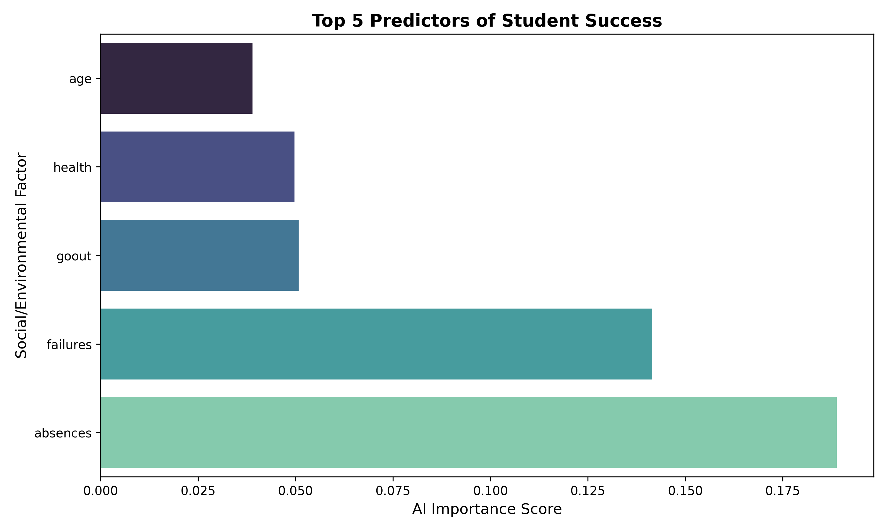

# Student Success AI: An Early Warning System for Educators

### About the project:
In a rapidly changing educational landscape, identifying at-risk students early is critical for academic equity. This project leverages Machine Learning (Random Forest) to predict student performance based on socio-economic and lifestyle factors rather than just past grades. 

The goal is to provide a tool for educators to intervene before a student falls behind, specifically focusing on factors like study habits, family support, and internet access.

---

### Technical Stack:
Language: Python 3.x
Libraries: "Pandas" for data manipulation and cleaning
"Scikit-Learn" for Machine Learning (Random Forest Regressor).
"NumPy" for numerical processing.

---

### How It Works?
1. Data Sourcing: Uses the UCI Student Performance Dataset, reflecting student life in secondary education.
2. Feature Engineering: I intentionally excluded previous exam scores ($G1$, $G2$) to force the model to identify patterns in social and environmental variables.
3. The Model: A Random Forest Regressor analyzes non-linear relationships between variables (e.g., how "absences" correlate with "internet access" and final outcomes).
4. Evaluation: The model is tested on unseen data to ensure accuracy and reliability.

---

### Key Insights & Impact
* Identifying Success Drivers: The model allows us to see which social factors (like mother's education or family size) have the highest impact on final grades.
* Early Intervention: By identifying students with a high "Predicted Failure Risk" early in the semester, schools can allocate resources more effectively.

---

### Future Goals
I plan to expand this model by:
* Adding a Visualization Dashboard using Matplotlib/Seaborn.
* Integrating a larger, more diverse global dataset to reduce regional bias.

---

### License
This project is licensed under the MIT License.
